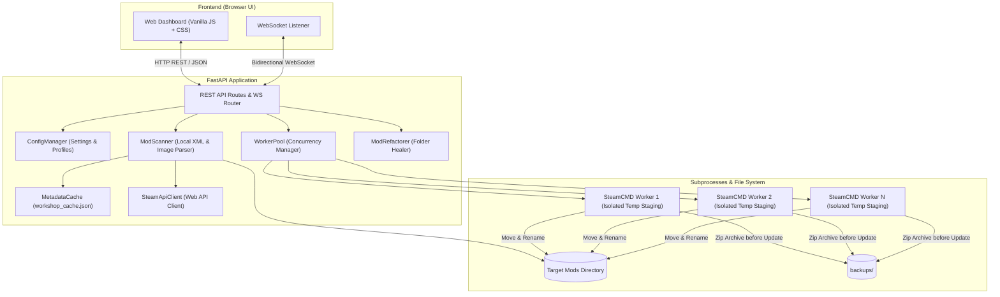

# Steam Workshop Downloader Controller: Comprehensive Documentation

Welcome to the comprehensive technical and operational documentation for the **Steam Workshop Downloader Controller**.

---

## Table of Contents

1. [System Architecture](#1-system-architecture)
   - [Core Design Philosophy](#core-design-philosophy)
   - [Backend Components](#backend-components)
   - [Worker Pool & SteamCMD Isolation](#worker-pool--steamcmd-isolation)
   - [Metadata Cache Engine](#metadata-cache-engine)
   - [Refactor & Healer Engine](#refactor--healer-engine)
2. [User Guide](#2-user-guide)
   - [Getting Started](#getting-started)
   - [Managing Installed Mods](#managing-installed-mods)
   - [Filtering by Dynamic Tags](#filtering-by-dynamic-tags)
   - [Downloading Mods & Collections](#downloading-mods--collections)
   - [Multi-Folder & Multi-Game Profiles](#multi-folder--multi-game-profiles)
   - [Healing & Refactoring Loose Mods](#healing--refactoring-loose-mods)
   - [Safe Shutdown Flow](#safe-shutdown-flow)
3. [REST API & WebSocket Reference](#3-rest-api--websocket-reference)
   - [Settings Endpoints](#settings-endpoints)
   - [Profile Management Endpoints](#profile-management-endpoints)
   - [Mods & Updates Endpoints](#mods--updates-endpoints)
   - [Download Queue Endpoints](#download-queue-endpoints)
   - [Refactor / Healer Endpoints](#refactor--healer-endpoints)
   - [System & Diagnostic Endpoints](#system--diagnostic-endpoints)
   - [WebSocket Event Protocol](#websocket-event-protocol)
4. [Configuration Reference](#4-configuration-reference)
   - [data/settings.json](#datasettingsjson)
   - [data/workshop_cache.json](#dataworkshop_cachejson)
5. [Standalone Packaging & Distribution](#5-standalone-packaging--distribution)
6. [Troubleshooting & FAQs](#6-troubleshooting--faqs)

---

## 1. System Architecture

### Core Design Philosophy
The Steam Workshop Downloader Controller is built for zero-friction operation by non-technical users ("people who find emails hard") while providing advanced concurrent capabilities for power gamers:
- **Zero-Dependency Bootstrapping**: Automatically detects or downloads SteamCMD directly from Valve's official CDN. No pre-installed SteamCMD, Python, or Node.js environment is required when running standalone builds.
- **Cross-Platform**: Operates natively on Windows, Linux, and macOS.
- **Embedded Web UI**: Self-contained frontend served via FastAPI without external CDN dependencies.
- **Resilient Offline Caching**: Steam Workshop metadata, tags, and thumbnails are persisted locally to eliminate slow repetitive API queries and prevent broken images.



---

### Worker Pool & SteamCMD Isolation

#### The Concurrency Problem with SteamCMD
When multiple instances of SteamCMD download simultaneously to the same root folder, they experience race conditions:
1. Shared write locks on `steamapps/appworkshop_<appid>.acf`.
2. File corruptions caused by simultaneous cache verification.
3. Random download failures and stalled processes.

#### The Isolation Solution
The Controller implements an isolated worker pool:
- Each worker instance runs inside its own isolated temporary directory (`temp_workers/worker_<N>/`).
- Workers run separate SteamCMD child processes downloading to staging directories.
- Upon successful download:
  1. Inspects the mod's authoritative `About/About.xml` to discover the official title.
  2. If an existing version exists in the target folder and `auto_backup` is enabled, creates a compressed zip archive in `backups/`.
  3. Atomically moves the downloaded mod into the target mod folder named with the friendly title.
  4. Generates or updates `About/PublishedFileId.txt` and `About/.lastupdated`.
  5. Cleans up temporary staging files.

---

### Metadata Cache Engine

To guarantee instant page loads and prevent image flickering:
- **Location**: `data/workshop_cache.json`
- **Cached Fields**:
  - `title`: Sanitized mod name
  - `preview_url`: Steam CDN image URL
  - `tags`: Array of categories, game versions, and descriptors
  - `time_updated`: Unix timestamp of latest Workshop release
- **Thread Safety**: Uses `threading.RLock()` and atomic file writes to ensure data integrity during parallel operations.
- **Automatic Fallback**: On first scan, uncached items are batch-resolved via Steam Web API (`ISteamRemoteStorage/GetPublishedFileDetails/v0001/`) in 200ms batch chunks and permanently cached.

---

### Refactor & Healer Engine

Gamers frequently possess mods downloaded manually from third-party sites or direct zip files. These mods typically:
1. Are named by raw numeric Workshop IDs (e.g. `2009463077` instead of `Harmony`).
2. Lack `PublishedFileId.txt`, preventing update checks.
3. Lack `.lastupdated` timestamps.
4. May return `result=9` (`k_EResultFileNotFound`) from Steam's public API due to unlisted or mature tags (e.g. *Nurse Job - Prisoners* `3606988458`, *Personal Doors* `3244733349`).

#### The Healer Workflow:
1. **Detection**: Scans folder for `About/About.xml`, reading `<name>`, `<description>`, and `<url>`.
2. **ID Recovery**: Detects numeric IDs from folder names, URL strings, and embedded XML text.
3. **Local Authority First**: If Steam API details return `result=9` or are unreachable, the healer relies on the local `About.xml` `<name>` as the ground truth.
4. **Renaming & Standardization**:
   - Renames folder to the sanitized mod title (e.g. `Nurse Job - Prisoners`).
   - Writes `About/PublishedFileId.txt` containing the numeric ID.
   - Writes `About/.lastupdated` with the current timestamp.
   - Immediately brings the mod into the automated update lifecycle.

---

## 2. User Guide

### Getting Started

#### Launching the Application
- **Windows**: Double-click `run.bat` (or execute `RimWorldWorkshopController.exe` in standalone releases).
- **Linux / macOS**: Execute `./run.sh` (or `./RimWorldWorkshopController` in standalone releases).
- The application automatically checks for SteamCMD, starts the local server at `http://127.0.0.1:8080`, and opens your default browser.

---

### Managing Installed Mods

The **Installed Mods** tab provides an overview of all local mods:
- **Banner Preview**: High-resolution Steam preview image or local `Preview.png` / `ModIcon.png`.
- **Metadata Cards**: Displays Mod Title, Workshop ID, Author, Directory Size, and Tags.
- **Update Indicators**: Mods with newer versions available on Steam Workshop display a highlighted `UPDATE AVAILABLE` badge and an orange border.
- **Actions per Mod**:
  - **📁 Open**: Opens the mod directory in Windows Explorer / macOS Finder / Linux file manager.
  - **⬆️ Update**: Immediately enqueues the mod for update download.
  - **🗑️ Delete**: Opens a confirmation dialog to delete the mod folder from disk.

---

### Filtering by Dynamic Tags

The toolbar features dynamic tag aggregation:
1. **Tag Dropdown (`🏷️ All Tags`)**:
   - Automatically collects all unique tags from loaded mods.
   - Shows mod counts per tag (e.g. `1.5 (182)`, `Framework (14)`, `Quality of Life (35)`).
   - Prioritizes game version numbers (`1.6`, `1.5`, `1.4`) at the top of the list.
2. **Interactive Tag Pills**:
   - Each mod card displays clickable tag pills.
   - Clicking a pill instantly sets the tag filter to that category.
3. **Multi-Filter Support**:
   - Combine Search keywords + Status filter (`Updates Available`, `Steam Only`, `Non-Steam`) + Tag filter.

---

### Downloading Mods & Collections

1. Navigate to the **Download Queue** tab.
2. Paste one or more Workshop items into the text area:
   - **Full Workshop URLs**: `https://steamcommunity.com/sharedfiles/filedetails/?id=2009463077`
   - **Numeric IDs**: `2009463077 818773962`
   - **Collection URLs**: `https://steamcommunity.com/sharedfiles/filedetails/?id=3000000000` (automatically extracted into individual mod items)
3. Click **"⬇️ Download Mods"**.
4. The system validates the IDs, adds them to the queue, and parallel workers download and install them.

---

### Multi-Folder & Multi-Game Profiles

You can manage mods across multiple games (e.g. *RimWorld*, *Stellaris*, *Cities: Skylines*, *Project Zomboid*, *Garry's Mod*, etc.) or multiple folder installations:

#### Quick Switching in Navbar:
- Use the **🎮 Profile Selector** dropdown located in the top header.
- Selecting a profile immediately switches the target download directory, App ID, and reloads the Installed Mods tab for that game.

#### Managing Profiles in Settings:
1. Open the **Settings** tab.
2. Under **"🎮 Game & Mod Folder Profiles"**:
   - View all existing profiles with their App IDs, target folders, and active statuses.
   - Click **"Switch to this"** to activate a profile.
   - Click **"✏️ Edit"** to modify folder paths, names, or credentials.
   - Click **"🗑️ Delete"** to remove a profile.
   - Click **"➕ Add New Game Profile"** to create a profile using preset buttons (RimWorld, Stellaris, Cities: Skylines, Project Zomboid, Garry's Mod, Don't Starve Together) or custom inputs.

---

### Healing & Refactoring Loose Mods

1. Open the **Folder Refactor / Healer** tab.
2. Select your target directory (defaults to current profile's mod folder).
3. Click **"🔍 Scan Folder"**.
4. The Healer displays all detected loose mods with proposed renames:
   - `Folder: 2009463077 ➔ Harmony`
   - `Folder: Mod 3606988458 ➔ Nurse Job - Prisoners`
5. Click **"✨ Refactor & Adopt All"**:
   - The application processes each mod sequentially with a live progress bar.
   - Mod folders are safely renamed.
   - Official `PublishedFileId.txt` files are created.
   - Newly adopted mods immediately appear in the **Installed Mods** tab and receive automatic update checks.

---

### Safe Shutdown Flow

To stop the program without leaving orphan SteamCMD processes:
1. Click the red **"🛑 Stop"** button in the top navbar or under **Settings > Safety & Preferences**.
2. Confirm in the dialog.
3. The server cancels active worker subprocesses, broadcasts a shutdown signal via WebSocket, and cleanly exits.
4. A full-screen overlay notifies you that the application has stopped and the browser tab can safely be closed.

---

## 3. REST API & WebSocket Reference

Base URL: `http://127.0.0.1:8080/api`

### Settings Endpoints

#### `GET /api/settings`
Returns current configuration, resolved mod path, and SteamCMD status.
```json
{
  "settings": {
    "download_path": "",
    "max_parallel_workers": 3,
    "app_id": 294100,
    "game_name": "RimWorld",
    "steam_user": "anonymous",
    "auto_backup": true,
    "auto_open_browser": true,
    "active_profile_id": "default",
    "profiles": [...]
  },
  "resolved_download_path": "/path/to/mods",
  "steamcmd_found": true,
  "steamcmd_path": "/path/to/steamcmd"
}
```

#### `POST /api/settings`
Updates top-level settings (worker count, steam credentials, auto-backup, etc.).
```json
{
  "max_parallel_workers": 4,
  "auto_backup": true
}
```

---

### Profile Management Endpoints

#### `GET /api/profiles`
Returns all configured profiles and the active profile.
```json
{
  "active_profile_id": "default",
  "active_profile": {
    "id": "default",
    "name": "RimWorld",
    "app_id": 294100,
    "folder_path": "",
    "steam_user": "anonymous"
  },
  "profiles": [...]
}
```

#### `POST /api/profiles/switch`
Switches the active profile.
```json
// Request
{
  "profile_id": "stellaris_mods"
}

// Response
{
  "status": "success",
  "active_profile": { ... },
  "resolved_download_path": "/path/to/stellaris/mods"
}
```

#### `POST /api/profiles/add-or-update`
Creates or updates a profile definition.
```json
// Request
{
  "profile": {
    "id": "stellaris_mods",
    "name": "Stellaris",
    "app_id": 281990,
    "folder_path": "/path/to/stellaris/mods",
    "steam_user": "anonymous"
  }
}
```

#### `POST /api/profiles/delete`
Deletes a profile (cannot delete if it is the only profile).
```json
// Request
{
  "profile_id": "stellaris_mods"
}
```

---

### Mods & Updates Endpoints

#### `GET /api/mods`
Scans the current mod folder. Populates thumbnails and tags from `metadata_cache` and automatically fetches missing IDs in batch.
- **Query Params**: `check_updates` (bool, default: `false`)
```json
{
  "count": 225,
  "download_path": "/path/to/mods",
  "mods": [
    {
      "mod_id": "2009463077",
      "folder_name": "Harmony",
      "folder_path": "/path/to/mods/Harmony",
      "name": "Harmony",
      "author": "pardeike",
      "preview_url": "https://steamuserimages-a.akamaihd.net/...",
      "local_updated_time": 1720000000,
      "remote_updated_time": 1720000000,
      "update_available": false,
      "is_non_steam": false,
      "size_bytes": 1048576,
      "tags": ["1.4", "1.5", "1.6", "Framework"]
    }
  ]
}
```

#### `POST /api/mods/check-updates`
Forces an online check against Steam Workshop API for all installed mods.

#### `POST /api/mods/update-outdated`
Automatically adds all outdated mods to the download queue.

#### `POST /api/mods/delete`
Permanently deletes a mod folder from disk.
```json
// Request
{
  "folder_path": "/path/to/mods/OutdatedMod"
}
```

#### `POST /api/mods/open-folder`
Opens a folder in the host operating system's native file manager.
```json
// Request
{
  "folder_path": "/path/to/mods"
}
```

---

### Download Queue Endpoints

#### `POST /api/mods/download`
Enqueues Workshop IDs, URLs, or Collection links for parallel download.
```json
// Request
{
  "input_text": "https://steamcommunity.com/sharedfiles/filedetails/?id=2009463077 818773962",
  "app_id": 294100
}
```

#### `GET /api/queue`
Returns active worker status and queue items.

#### `POST /api/mods/cancel`
Cancels a specific item or clears all queued downloads.
```json
// Request
{
  "cancel_all": true
}
```

---

### Refactor / Healer Endpoints

#### `POST /api/refactor/scan`
Scans a directory for loose mods requiring adoption or renaming.
```json
// Request
{
  "target_path": "/path/to/mods"
}
```

#### `POST /api/refactor/execute`
Executes folder renaming and `PublishedFileId.txt` creation.
```json
// Request
{
  "items": [
    {
      "folder_path": "/path/to/mods/2009463077",
      "mod_id": "2009463077",
      "rename_folder": true,
      "force_title": "Harmony"
    }
  ]
}
```

---

### System & Diagnostic Endpoints

#### `GET /api/system/status`
Returns general diagnostics, SteamCMD executable path, worker count, and active game profile.

#### `POST /api/system/shutdown`
Initiates clean worker termination, notifies clients, and exits the server process.

#### `GET /api/local-preview?path=<path>`
Streams local preview images (`.png`, `.jpg`, `.webp`) securely to the browser.

---

### WebSocket Event Protocol

Endpoint: `ws://127.0.0.1:8080/api/ws`

Clients receive real-time JSON packets:
- `init`: Initial snapshot of queue, worker statuses, and console logs.
- `queue_updated`: Emitted when download progress, speeds, or statuses change.
- `workers_updated`: Emitted when worker instances cycle between `idle` and `downloading`.
- `log`: Terminal log lines emitted from SteamCMD child processes.
- `shutdown`: Emitted when system termination is initiated.

---

## 4. Configuration Reference

### `data/settings.json`
```json
{
  "download_path": "",
  "max_parallel_workers": 3,
  "app_id": 294100,
  "game_name": "RimWorld",
  "steam_user": "anonymous",
  "steam_pass": "",
  "auto_backup": true,
  "web_port": 8080,
  "auto_open_browser": true,
  "steamcmd_custom_path": "",
  "active_profile_id": "default",
  "profiles": [
    {
      "id": "default",
      "name": "RimWorld",
      "app_id": 294100,
      "folder_path": "",
      "steam_user": "anonymous"
    }
  ]
}
```

### `data/workshop_cache.json`
```json
{
  "2009463077": {
    "title": "Harmony",
    "preview_url": "https://steamuserimages-a.akamaihd.net/...",
    "tags": ["1.4", "1.5", "1.6", "Framework"],
    "time_updated": 1720000000
  }
}
```

---

## 5. Standalone Packaging & Distribution

The controller includes an automated PyInstaller packaging pipeline in `packaging/`:

### Building Standalone Executables:
- **Windows (Command Prompt / PowerShell)**:
  ```cmd
  packaging\build_windows.bat
  ```
- **Windows (Git Bash / MSYS2 / bash)**:
  ```bash
  ./packaging/build_windows.sh
  ```
- **Linux / macOS**:
  ```bash
  chmod +x packaging/build_linux.sh
  ./packaging/build_linux.sh
  ```

### Distribution Features:
- Packages Python runtime, FastAPI, Uvicorn, and all static frontend assets into a single self-contained application directory.
- End users do not need to install Python, pip, or dependencies.
- On first execution, the application automatically bootstraps SteamCMD into its local `data/steamcmd` directory.

---

## 6. Troubleshooting & FAQs

### Q1: SteamCMD fails to download on first launch
- **Cause**: Network restrictions, firewalls, or Valve CDN rate limits.
- **Solution**: You can install SteamCMD manually and specify its path in **Settings > Custom SteamCMD Executable Path**.

### Q2: Download fails with "Access Denied" or "No Subscription"
- **Cause**: The target game does not permit anonymous mod downloads.
- **Solution**: Go to **Settings > Steam Account Credentials**, switch from `anonymous` to your Steam account username and password, and click Save Settings.

### Q3: How do I change the default port (8080)?
- **Solution**: Edit `data/settings.json` and change `"web_port": 8080` to any available port (e.g. `9090`), then restart the application.

### Q4: Port already in use error
- **Solution**: The launcher detects if an instance is already running on port 8080. If another application occupies port 8080, change the port in `data/settings.json` or terminate the conflicting process.
